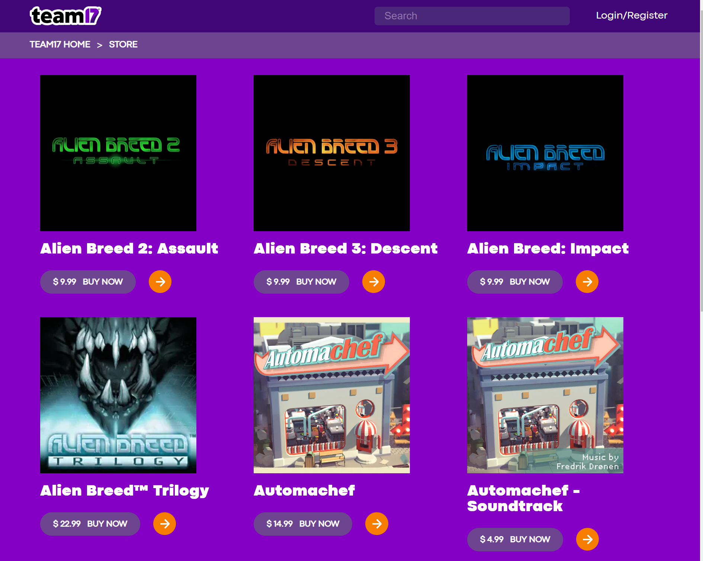

This is a [Next.js](https://nextjs.org/) project bootstrapped with [`create-next-app`](https://github.com/vercel/next.js/tree/canary/packages/create-next-app).

<a name="readme-top"></a>


<!-- PROJECT LOGO -->
<br />
<div align="center">

<h3 align="center">Game Catalog</h3>
  <p align="center">
   A webpage to display a list of games from an external API
    <br />
    <a href="https://nextjs.org/docs"><strong>Explore the docs »</strong></a>
    <br />
  </p>
</div>


<!-- TABLE OF CONTENTS -->
<details>
  <summary>Table of Contents</summary>
  <ol>
    <li>
      <a href="#about-the-project">About The Project</a>
      <ul>
        <li><a href="#built-with">Built With</a></li>
      </ul>
    </li>
    <li>
      <a href="#getting-started">Getting Started</a>
      <ul>
        <li><a href="#prerequisites">Prerequisites</a></li>
        <li><a href="#installation">Installation</a></li>
      </ul>
    </li>
    <li><a href="#contact">Contact</a></li>
  </ol>
</details>


<!-- ABOUT THE PROJECT -->
## About The Project



Develop a responsive and visually appealing website that showcases a catalog of games fetched from the provided API, with game cards designed to reference the given an example:

Features:
* Retrieve the list of games from the provided API endpoint.
* Implement pagination to allow users to navigate through the list of games efficiently.
* Craft a responsive design that seamlessly functions across various screen sizes on desktop and mobile devices.
* Employ CSS modules for component styling

<p align="right">(<a href="#readme-top">back to top</a>)</p>


### Built With

* [![Next][Next.js]][Next-url]
* [![React][React.js]][React-url]

<p align="right">(<a href="#readme-top">back to top</a>)</p>


<!-- GETTING STARTED -->
## Getting Started

To get a local copy up and running follow these simple example steps.

### Prerequisites

This is an example of how to list things you need to use the software and how to install them.
* npm
  ```sh
  npm install npm@latest -g
  ```

### Installation
1. Clone the repo
   ```sh
   git clone https://github.com/Evan1115/Game-Catalog.git
   ```
2. Install NPM packages
   ```sh
   npm install
   ```
3. Run the development server
   ```sh
   npm run dev
   ```
After that open [http://localhost:3000](http://localhost:3000) with your browser to see the result.

4. (Optional)Check code formatting
   ```sh
   npm run lint
   ```

<p align="right">(<a href="#readme-top">back to top</a>)</p>


<!-- CONTACT -->
## Contact

Evan - jing111597@gmail.com

Personal Website: [https://www.evancode.dev/](https://www.evancode.dev/)

Project Link: [https://github.com/Evan1115/Game-Catalog](https://github.com/Evan1115/Game-Catalog)

<p align="right">(<a href="#readme-top">back to top</a>)</p>

[Next.js]: https://img.shields.io/badge/next.js-000000?style=for-the-badge&logo=nextdotjs&logoColor=white
[Next-url]: https://nextjs.org/
[React.js]: https://img.shields.io/badge/React-20232A?style=for-the-badge&logo=react&logoColor=61DAFB
[React-url]: https://reactjs.org/